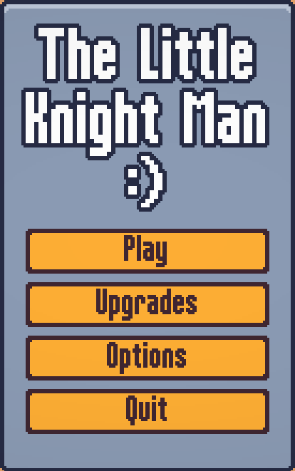
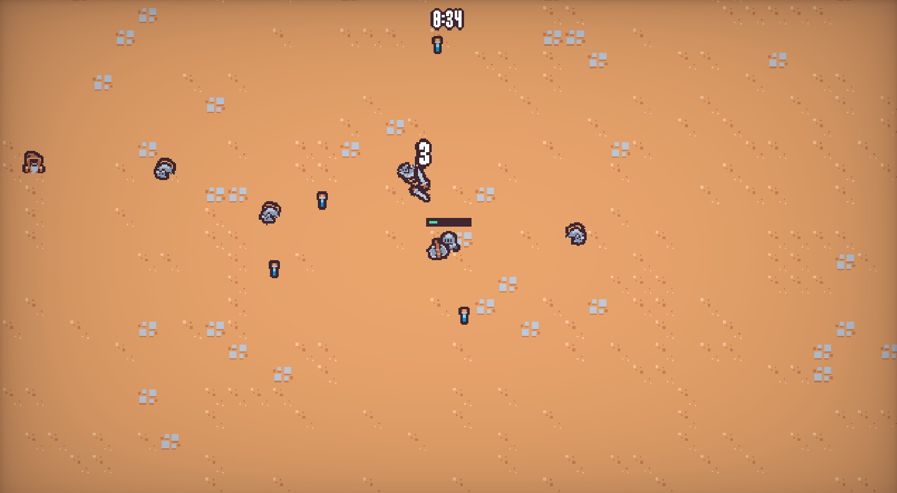
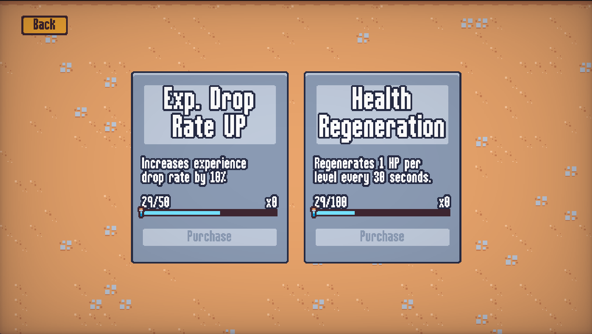
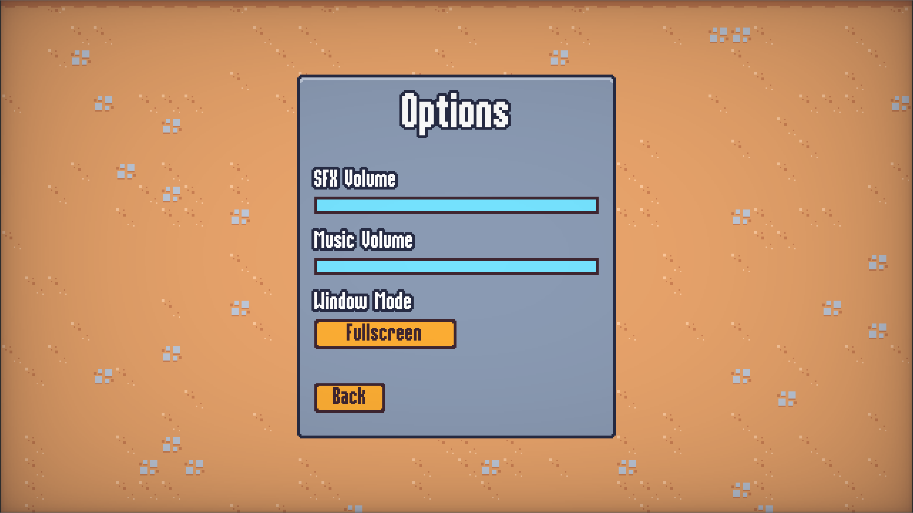

# LittleKnightMan-Godot4
🦇 Vampire Survivors-inspired project to understand how to implement more advanced features like persistent upgrades, saving/loading, shaders, etc.

To inspect the code, look for files ending with `.gd` within the [scenes/](scenes/) folder.

To play the game, download and extract `LKM 1.x.zip`. Run `LittleKnightMan 1.x.exe`.

Download here: [LittleKnightMan v1.0](https://drive.google.com/drive/folders/1PlLHgZdyIhd1-nD8thEoXLUK3CAylk6F?usp=sharing) (Google Drive link)

Future games will most likely be hosted and available on itch.io.

## Screenshots

